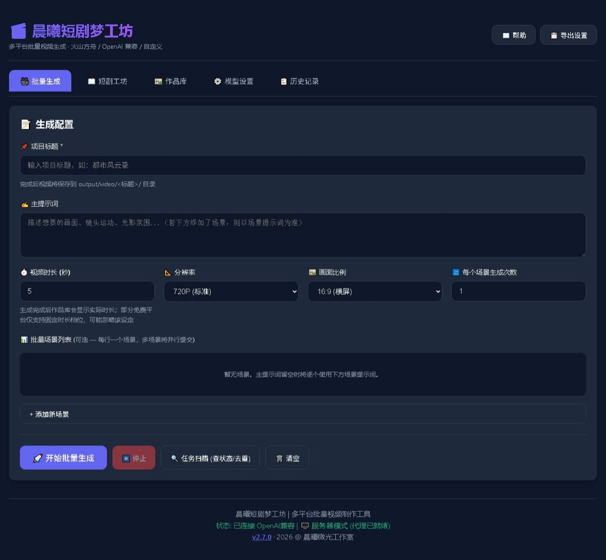
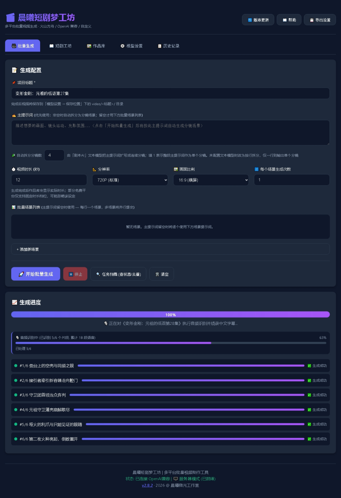

Multi-Platform AI Video Batch Generation Tool

晨曦短剧梦工坊

多平台 AI 视频批量生成工具 —— 支持火山方舟（豆包 Seedance）、OpenAI 兼容接口及完全自定义 JSON 平台。
内置 **短剧工坊**：文本AI根据主提示词延伸每集剧情，人物面孔/声音全剧锁定，一键生成下一集，支持全剧挂机到完结。





> Copyright (c) 2026 @ 晨曦微光工作室 · 基于 MIT 许可证开源发布


版本升级

- 首页右上角"🔄 版本更新"入口：有新版本时**闪烁提醒并弹窗一次**，无新版本时自动隐藏；
- **程序内一键更新**：检测到新版本后点"⬇️ 立即更新"（或直接点闪烁的入口）弹出更新窗口，**自动下载并显示进度条**（百分比 / 已下载 / 速度，可随时取消）；下载期间可继续使用其他功能；
- **装到原路径并自动重启**：点"🔧 立即安装并重启"后程序先退出 → 静默安装到原来的安装路径 → 自动打开新版本；`output/` 作品、剧本存档与设置全部保留；
- 便携版（单文件 exe）无法覆盖正在运行的文件：会把新版下载到程序旁边并引导你关闭本程序后运行新文件；
- 点"稍后/取消"只关掉本次窗口：之后再点"🔄 版本更新"或"🔍 检查更新"仍会弹出更新窗口执行更新（已下好的同一版本不会重复下载）；
- 检查更新为可选功能，离线/检查失败**不影响旧版本任何功能**；
- **发布者发版清单**：① 打包 `npm run desktop:build`；② 更新 `latest.json`（`version` 必须大于线上版本，`url` 指安装包、`portableUrl` 指便携包，`history` 保留最近 5 条）；③ 把安装包/便携包上传到下载站；④ **同时把下载站上的 `latest.json` 也更新成新版** —— 老客户端会优先读站点那份清单，站点长期不更新（曾停在 2.8.3）会让老用户一直收不到更新提醒。


 快速开始

方式一：服务器模式（推荐）

```bash
# 首次运行：安装依赖
npm install

启动服务器
npm start

# 浏览器访问 http://localhost:3000
```

或双击 `start-server.bat` / `launcher.bat`。

方式二：桌面便携版（免安装）

```bash
# 打包（只需一次，需要本地准备 resources/ 目录）
npm run desktop:build

# 运行生成的便携版 exe（在 desktop-dist/ 目录）
# 双击即可运行，无需安装 Node.js / Python / FFmpeg
```

方式三：桌面安装版（向导式安装，可选安装目录）

```bash
npm run desktop:build
# 产物：desktop-dist/晨曦短剧梦工坊-安装版-v<版本>.exe
```

- 安装过程是向导式：**可以选择安装位置**（默认 `%LOCALAPPDATA%\Programs\agnes-2.5-video-generator`，想装到 D 盘等其它位置直接改）；装完可在完成页直接勾选运行；
- **覆盖升级不需要手动卸载**：直接运行新版安装包，它会关闭正在运行的旧版，并装回**上次选择的安装目录**；
- **程序内自动更新同样装回原目录**（静默升级沿用已记录的安装位置）；
- 作品库、剧本存档、设置都在用户数据目录（`%APPDATA%\agnes-2.5-video-generator`）里，升级/卸载都不删除（配置项 `deleteAppDataOnUninstall: false`）。


核心功能

🎬 多平台视频生成

| 平台预设 | 提交端点 | 查询端点 |
|---------|---------|---------|
| **自动识别**（推荐） | — | — |
| 火山方舟 (Seedance) | `POST {base}/contents/generations/tasks` | `GET {base}/contents/generations/tasks/{id}` |
| OpenAI 兼容 | `POST {base}/videos` | `GET {base}/videos/{id}` |
| 完全自定义 | `POST {base}/videos`（JSON 模板） | 自定义查询路径 |

**支持的模型：**
- `doubao-seedance-*`（方舟）→ 最大 60s，档位 4/8/12/16/20/24/30/60s
- `agnes-video-2.5-flash` → 最大 12s，档位 4/8/12s
- `agnes-video-v2.0` → 固定 5s

> 选择模型后，分镜时长会自动适配为该模型支持的最大值。

📖 短剧工坊

用"剧本AI"把一句主线提示词扩展成整集短剧，并自动批量生成视频：

1. **剧集设定**：填剧集名称、类型、世界观与主线提示词、每集分镜数、默认分镜时长
2. **人物设定卡**：AI 生成每个角色的面孔/声音/服装锁定描述
3. **本集分镜**：AI 生成带景别/动作/对白/音效的完整分镜，可逐条编辑
4. **启动生成**：批量提交视频生成，完成后自动合并成片 + 烧录中文字幕

🔍 任务扫描

点击"任务扫描 (查状态/去重)"可：
- **合并重复**：相同内容直接复用，不重复扣配额
- **补全取回**：查询平台真实状态，完成的任务自动下载视频
- **失败重试**：扫描完成后弹窗提示，用户可选择"重试失败任务"或"查看作品库"
- **查重标记**：完成作品查重，标记重复作品供清理

🎥 视频合并与字幕烧录

生成完成后自动执行：
1. 按顺序合并所有分镜视频片段
2. VAD（语音检测）精准切分语音段
3. sherpa-onnx SenseVoice 逐段 ASR 识别
4. 噪声过滤（过滤纯标点、英文单字、短噪声）
5. 长段（>4秒）按时间硬切为多段字幕
6. 烧录微软雅黑字幕到画面底部居中

输出 `<剧名>_完整版.mp4`（**原始分镜片段全部保留不删除**）

🖼️ 作品库

- **视频封面**：生成完成的视频自动取第一帧画面当海报展示；图片作品直接显示原图
- **开头黑场规避**：片段开头是黑场（AI 片段常见的淡入）时，自动往后取第一张有画面的帧，封面不会是一块黑
- **按需生成 + 缓存**：首次浏览时用内置 ffmpeg 抽帧，结果缓存在作品库的 `.posters` 目录，同一文件只抽一次；成片重新合并后封面自动换新
- **失败回退**：取不到画面（文件缺失/非媒体文件）时回退成原来的 🎬/🖼️ 图标，不会出现破图

💾 剧本存档

支持跨季续写：
- **保存存档**：保存剧集设定、人物卡、集数历史与悬念
- **导入续季**：人物卡逐字节继承，季数自动 +1
- **导出/导入**：JSON 备份，跨设备迁移

---

桌面便携版说明

便携版内置完整运行环境（Python 3.11 + ffmpeg + SenseVoice ASR 模型），打包后约 300MB，可在任何 Windows 电脑上直接运行。

**本地打包步骤：**

```bash
1. 安装依赖
npm install

2. 准备内嵌资源（一次性操作）
    将 ffmpeg、Python 运行时、ASR 模型放入 resources/ 目录：
    resources/
    ├── python_temp/     # Python 3.11 嵌入版 + sherpa_onnx/soundfile/numpy (约110MB)
    ├── ffmpeg/          # ffmpeg 7.0.2 (约165MB)
    └── asr_model/       # SenseVoice ASR 模型 (约229MB)

3. 打包
npm run desktop:build
产物在 desktop-dist/：
   晨曦短剧梦工坊-v2.8.10-便携版.exe
   晨曦短剧梦工坊-安装版-v2.8.10.exe
```

**便携模式资源路径：**
- Electron 打包后自动设置 `process.resourcesDir`
- 代码自动检测嵌套路径 `resourcesDir/resources/`（extraResources 打包结果）
- 通过环境变量 `AGNES_FFMPEG` / `AGNES_ASR_MODEL` 传递路径给 Python 脚本

---

关键机制

- **限流自适应 (429)**：全局串行排队；触发 429 统一冷却退避（20s→40s→60s→90s→120s）
- **轮询终态保护**：连续 404/网络错误/超 30 分钟标记"未知"，不再永久卡"排队中"
- **重复治理**：同标题同内容已完成视频直接复用，进度条显示"♻️ 复用"
- **模型时长自动适配**：选模型后默认分镜时长自动取最大值（Seedance 60s / v2.5 系 12s / v2.0 系 5s）
- **欠费阻断**：识别余额不足/配额耗尽（402 / insufficient_quota / "余额不足" 等）→ 自动暂停挂机并拦住后续提交，弹窗提示充值或换 Key；已完成片段与未完成任务连同提交参数全部保留，充值后点"重试"或"任务扫描并找回"即可接着跑
- **停止即结束本次全部任务**：点"停止挂机"会中断在途请求 + 收尾排队/生成中的任务 + 清掉进度记录（下次打开不再提示续跑）；"清除剧本任务"先弹对话框由用户选择是否停止全部剧本任务，清除后不留运行记录。任务记录与已保存的视频都不会被删
- **参考图自动图生视频**：分镜带参考图就走图生视频、没带就自动文生视频，无需手动切换（模型设置 → 参考图调用方式：参考图生成 / 首帧图生视频 / 不使用）。字段按各平台官方文档下发 —— Agnes Video 2.5 系 `mode=reference`+`images`（Flash 最多 5 张）或 `mode=keyframe`+`first_frame`，Agnes v2.0 单图 `image`、多图 `extra_body.image`+`keyframes`，火山方舟 Seedance 在 `content` 里带 `role`（first_frame/last_frame/reference_image）；其他聚合站字段名不统一，程序按候选逐个试并记住平台接受的那个；自定义 JSON 平台可用 `{{image_urls_json}}` / `{{image_url}}` / `{{mode}}` 自行拼接
- **版本更新记录**：版本更新页保留最近 5 条版本说明（读更新清单 latest.json 的 `history`，离线用本地缓存）
- **VAD+ASR 字幕**：语音检测 + 噪声过滤 + 长段硬切 + 字幕烧录，全流程自动化


目录结构

```
晨曦短剧梦工坊/
├── index.html               主界面
├── app.js                   前端逻辑（生成流程/短剧工坊/任务扫描/版本更新）
├── api-client.js            多平台 API 适配器（含模型时长识别）
├── server.js                Node 服务器（代理/落盘/作品库/合并接口）
├── merge_videos.py          视频合并 + VAD+ASR 字幕烧录核心脚本
├── video-poster.js          作品库封面（视频第一帧抽帧 + 缓存）
├── update-downloader.js     应用内更新下载（进度/重定向/超时/取消 + 安装包校验）
├── electron-process-video.js Electron IPC 处理器（便携模式资源定位）
├── electron-main.js         Electron 桌面版主进程
├── electron-preload.js      Electron 预加载桥
├── styles.css               样式
├── package.json             项目配置（v2.8.10）
├── latest.json              版本更新清单
├── assets/                  图标资源
├── output/                  生成结果（不推送, gitignore）
│   ├── images/              参考图片
│   └── video/               视频文件（按剧集标题分目录）
├── resources/               便携模式资源包（不推送，本地准备）
└── desktop-dist/            桌面版构建产物（不推送，npm run desktop:build 重建）
```


常见问题

**Q: 一直显示"排队中"？**
若个别任务仍显示 ❓未知，说明平台长时间未返回，点击"重试轮询"或到平台控制台核对任务 ID。

**Q: 批量生成时提示 429 / 限流？**
免费平台有速率限制。程序会自动重试并放慢提交；若任务标记为失败，直接点卡片上的"🔄 重试"即可重新提交。也可在"模型设置 → 高级参数 → 提交间隔"调大到 10~30 秒。

**Q: 提示 401/403？**
API 密钥无效，或方舟模型未在控制台开通。

**Q: 提示 404？**
检查端点是否正确（方舟需含 `/api/v3` 路径，只填主机名会自动补全）。

**Q: 双击 bat 无反应 / 服务器启动失败？**
确认已安装 Node.js 18+，并运行 `npm install`。

**Q: 便携版打开无反应？**
确认 `resources/` 目录已正确放置（Python/ffmpeg/ASR 模型），或重新执行 `npm run desktop:build`。
